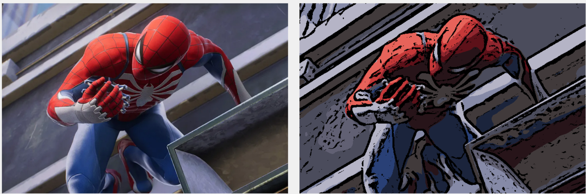
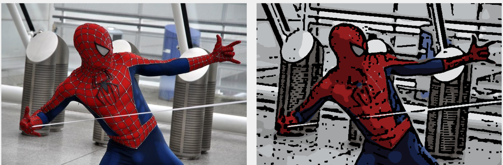
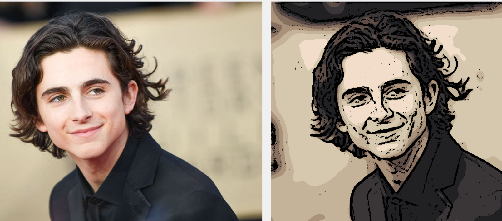
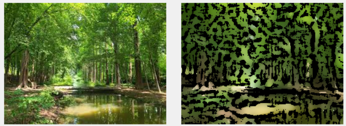
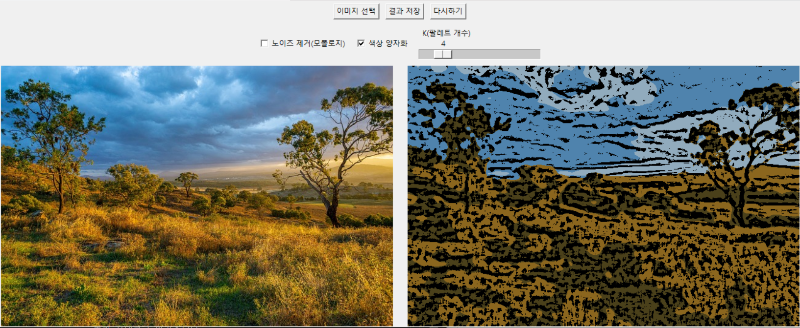
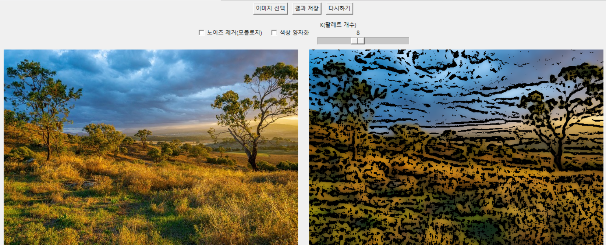

# Cartoon Renderer

OpenCV를 사용하여 이미지를 **만화(cartoon) 스타일**로 변환하는 Cartoon Renderer입니다다.  
이미지를 만화에 그린 그림처럼 보이도록 처리할 수 있습니다.

---

## 1. 프로젝트 소개

### 1.1 주요 기능
1. **이미지 선택**: 사용자가 원하는 이미지 파일을 선택할 수 있습니다.
2. **미리보기**: 원본 이미지와 변환된 카툰 이미지를 나란히 비교할 수 있습니다.
3. **추가 효과 옵션**:
   - 노이즈 제거(모폴로지 연산) 적용 여부
   - 색상 양자화 적용 여부
   - 색상 팔레트 개수(K) 조절 (2~16)
4. **결과 저장**: 변환된 카툰 이미지를 원하는 경로에 저장할 수 있습니다.

### 1.2 기술 스택
- 컴퓨터비전(예: Image Processing) 기술을 이용해 **주어진 이미지를 만화 스타일로 변환**합니다.
- Bilateral Filter + Median Blur + Adaptive Threshold 등 **기본적인 영상 처리 기법**을 조합하여 만화 효과를 구현합니다.

---

## 2. 설치 및 실행 방법

### 2.1 필수 라이브러리 설치
```bash
pip install opencv-python
pip install numpy
pip install Pillow
```

### 2.2 실행 방법
1. 프로젝트를 클론 또는 다운로드합니다.
2. 터미널에서 다음 명령어를 실행합니다:
```bash
python Cartoon_Renderer.py
```

### 2.3 GUI 사용법
1. "이미지 선택" 버튼을 클릭하여 변환할 이미지를 선택합니다.
2. 필요한 경우 다음 옵션들을 조정합니다:
   - **노이즈 제거 체크박스**
     - 활성화 시 모폴로지 연산을 통해 윤곽선의 잡음을 제거합니다.
     - 작은 점들이나 끊어진 선들이 정리되어 더 깔끔한 결과를 얻을 수 있습니다.
     - 특히 복잡한 배경이나 저해상도 이미지에서 효과적입니다.
   - **색상 양자화 체크박스**
     - 활성화 시 K-평균 군집화를 통해 이미지의 색상을 단순화합니다.
     - 비슷한 색상들을 하나의 대표 색상으로 묶어 만화적인 느낌을 강화합니다.
     - 자연스러운 그라데이션이 계단식 색상 변화로 바뀝니다.
   - **K(팔레트 개수) 슬라이더 (2~16)**
     - 색상 양자화 시 사용할 최종 색상의 개수를 지정합니다.
     - 값이 작을수록 더 단순하고 추상적인 결과가 나옵니다.
     - 값이 클수록 원본에 가까운 다양한 색상이 보존됩니다.
     - 일반적으로 8~12 사이의 값이 적절한 결과를 보여줍니다.
3. "결과 저장" 버튼을 클릭하여 변환된 이미지를 저장합니다.
4. "다시하기" 버튼으로 초기 상태로 돌아갈 수 있습니다.

---

## 3. 알고리즘 설명

### 3.1 이미지 변환 과정
1. **색상 영역 처리**
   - Bilateral Filter를 반복 적용하여 색상 영역을 부드럽게 만듭니다.
   - (선택적) K-평균 군집화로 색상을 양자화합니다.

2. **윤곽선 추출**
   - 그레이스케일 변환 후 Median Blur로 노이즈를 제거합니다.
   - Adaptive Threshold로 윤곽선을 검출합니다.
   - (선택적) 모폴로지 연산으로 윤곽선을 정제합니다.

3. **최종 합성**
   - 처리된 색상 영역과 윤곽선을 합성하여 카툰 효과를 완성합니다.

### 3.2 주요 매개변수
- `num_bilateral`: Bilateral Filter 반복 횟수 (기본값: 5)
- `median_ksize`: Median Blur 커널 크기 (기본값: 7)
- `blockSize`: Adaptive Threshold 블록 크기 (기본값: 9)
- `C`: Threshold 계산 시 차감되는 상수 (기본값: 2)

---

## 4. 변환 결과 예시

### 4.1 잘 표현되는 이미지
- **명확한 윤곽선**과 **뚜렷한 색 구분**이 있는 이미지에서 효과가 좋습니다.
  - 예: 단색 배경 인물 사진, 애니메이션 캐릭터 그림, 제품 사진 등
- 배경이 단순하고 색 대비가 확실할수록, Bilateral Filter로 색 영역이 깔끔하게 뭉치고 윤곽선이 선명하게 추출됩니다.







### 4.2 잘 표현되지 않는 이미지
- 배경이 복잡하거나, 조도가 낮아 노이즈가 많은 이미지
  - 예: 야간 사진, 해상도가 낮은 사진, 군중이 많은 거리 사진
- 엣지 검출이나 Bilateral Filter가 노이즈를 제대로 걸러내지 못하면, **불필요한 점(노이즈)**들이 많이 생기거나 윤곽선이 지저분해질 수 있습니다.



### 4.3 옵션 사용
- 노이즈 제거, 색상 양자화, 팔레트 개수 선택을 통해 다양한 느낌으로 이미지를 변환하는 옵션 사용 예시입니다.




- 상단 옵션 조절을 통해 원하는 스타일의 이미지를 표현할 수 있습니다.
---

## 5. 알고리즘 한계점

1. **복잡한 배경**  
   - 배경에 디테일이 많으면 노이즈처럼 처리되어 윤곽선이 과도하게 그려지거나 끊겨 보일 수 있습니다.

2. **조도(라이팅) 문제**  
   - 이미지에 빛이 고르지 못하면, Adaptive Threshold가 검출하는 엣지가 불규칙하게 나타나 만화 느낌이 떨어질 수 있습니다.

3. **매개변수 설정**  
   - Bilateral Filter를 여러 번 적용하면 과도하게 부드러워지고, 너무 적게 적용하면 평활화가 부족합니다.  
   - `blockSize`나 `C` 같은 파라미터도 상황에 맞게 손으로 조정해야 하므로, 이미지마다 최적화가 필요합니다.

4. **실시간 처리 부담**  
   - Bilateral Filter를 여러 번 적용하면 연산 비용이 커서, 고해상도 이미지나 실시간 처리는 다소 부담이 있을 수 있습니다.

---

## 6. 기여하기
버그 리포트나 새로운 기능 제안은 GitHub Issues를 통해 제출해 주세요.

## 7. 라이선스
이 프로젝트는 MIT 라이선스 하에 공개되어 있습니다.
