# Cartoon Vision

OpenCV 기반의 이미지·영상 카툰화 프로젝트입니다.

기존 **Cartoon Renderer**와 **Cartoon Recorder**를 하나의 저장소로 통합하여,
정적 이미지 변환과 실시간 영상 처리를 함께 다룹니다.

## Structure

```text
Cartoon_Renderer/
├── README.md
├── requirements.txt
├── image/
│   ├── cartoon_renderer.py
│   └── examples/
└── video/
    ├── cartoon_recorder.py
    └── examples/
```

## Image Cartoonization

`image/cartoon_renderer.py`는 Tkinter GUI에서 이미지를 선택하고 OpenCV로 카툰 스타일로 변환합니다.

주요 기능:
- Bilateral Filter 기반 색 영역 평활화
- Median Blur
- Adaptive Threshold 기반 윤곽선 추출
- 선택적 Morphology 기반 노이즈 제거
- K-means 기반 색상 양자화
- 변환 결과 미리보기 및 저장

실행:

```bash
python image/cartoon_renderer.py
```

### 결과 예시

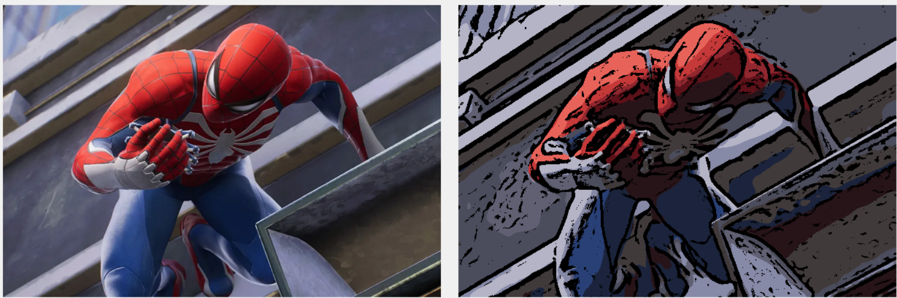
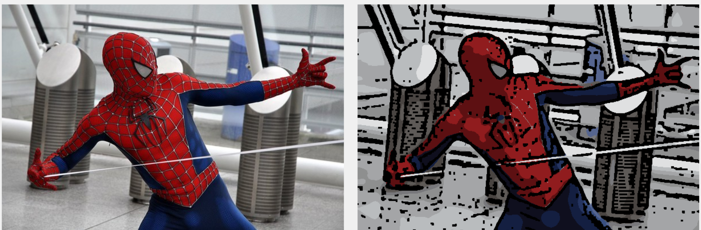
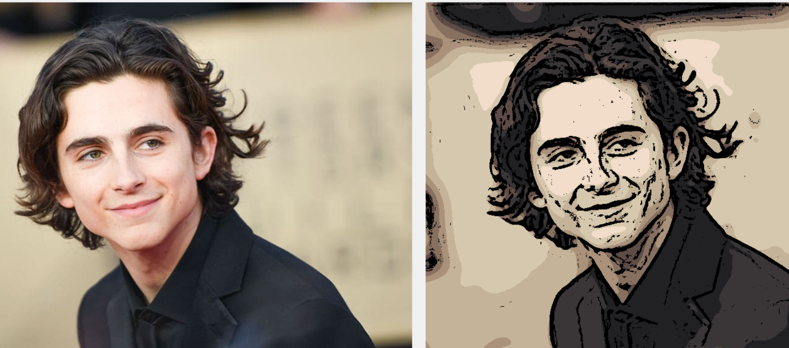

복잡한 배경에서는 윤곽선 노이즈가 증가할 수 있습니다.

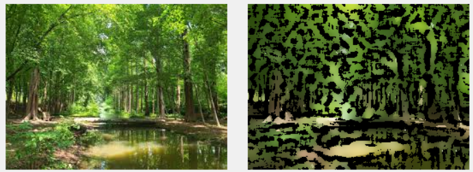

색상 양자화와 노이즈 제거 옵션을 적용한 예시입니다.

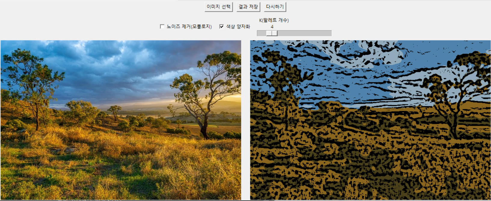
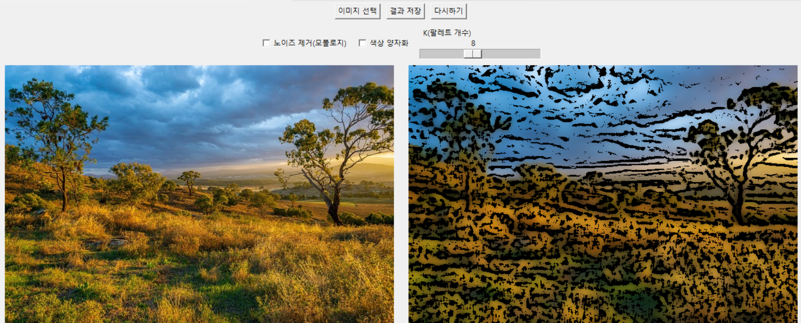

## Real-time Cartoon Video

`video/cartoon_recorder.py`는 웹캠 또는 RTSP 입력을 실시간으로 처리합니다.

주요 기능:
- 실시간 카툰 필터
- 웹캠 / RTSP 입력
- 눈·비·꽃잎 파티클 효과
- AVI 영상 녹화
- Preview / Record 모드

실행:

```bash
python video/cartoon_recorder.py --camera 0
```

RTSP 입력:

```bash
python video/cartoon_recorder.py --camera "rtsp://..."
```

조작:
- `Space`: 녹화 시작/중지
- `C`: 카툰 필터 켜기/끄기
- `S`: 눈 효과
- `R`: 비 효과
- `F`: 꽃잎 효과
- `ESC`: 종료

### 실행 화면

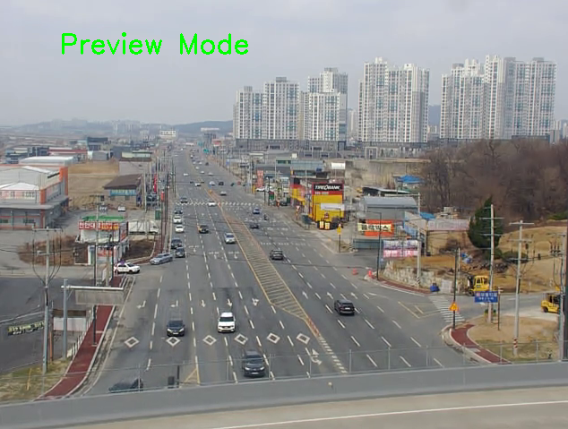
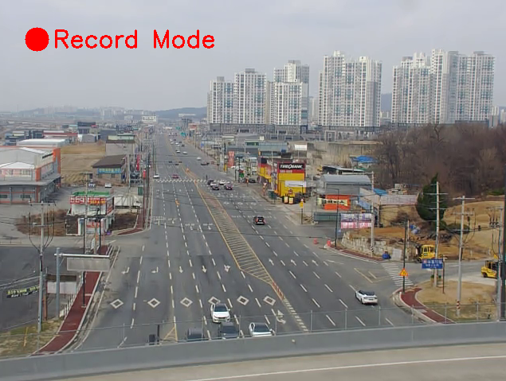
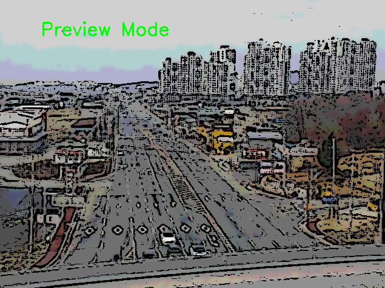

파티클 효과:

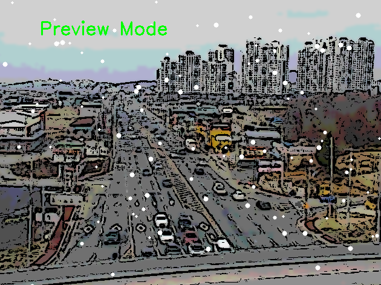
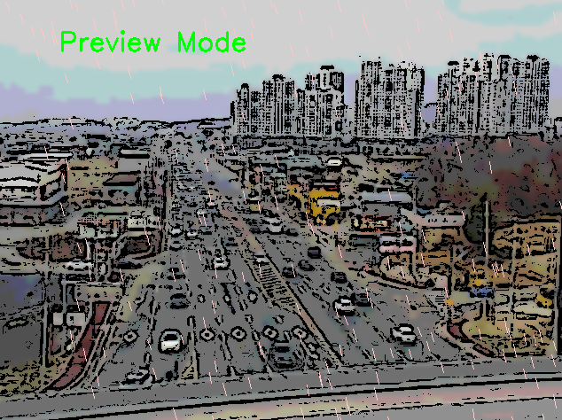
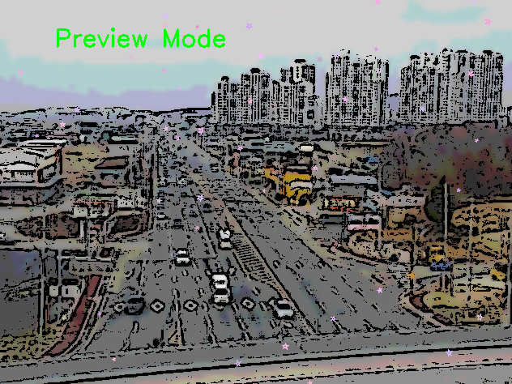

## Installation

```bash
pip install -r requirements.txt
```

## Project scope

두 프로그램은 같은 OpenCV 기반 카툰화 아이디어를 서로 다른 입력에 적용합니다.

- Image 모듈: 정적 이미지 품질과 변환 옵션
- Video 모듈: 실시간 처리, 카메라 입력, 녹화와 시각 효과

기존 구현 로직은 변경하지 않고 하나의 프로젝트 구조로 통합했습니다.
